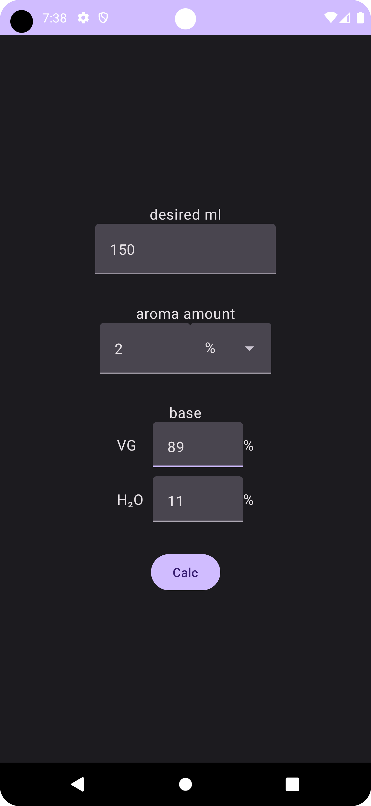
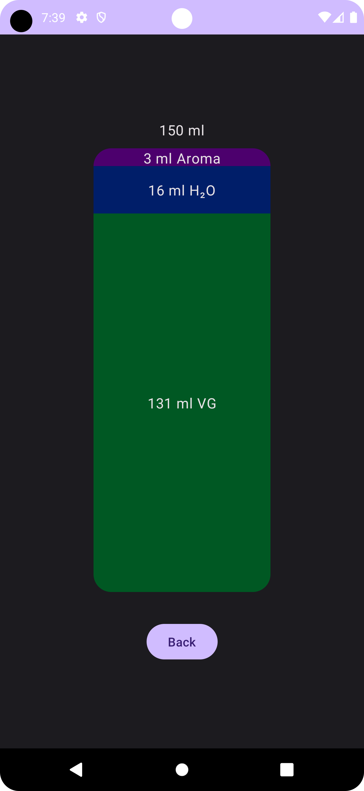

# Liquid mix
This app is a little tool you can use to mix your e-liquid for vapes. It's only supporting a base in combination with VG and H2O/Water. It's not supporting nicotine.

 

## Setup
### 1. Download the app(.apk)
Please take a look at the release tab here in the repository.
### 2. Install the app(.apk)
You have to allow installing apps from unknown sources via settings.
### 3 Have fun!

# Development information
This project was created with android studio so for a struggle-less start you also should use it!